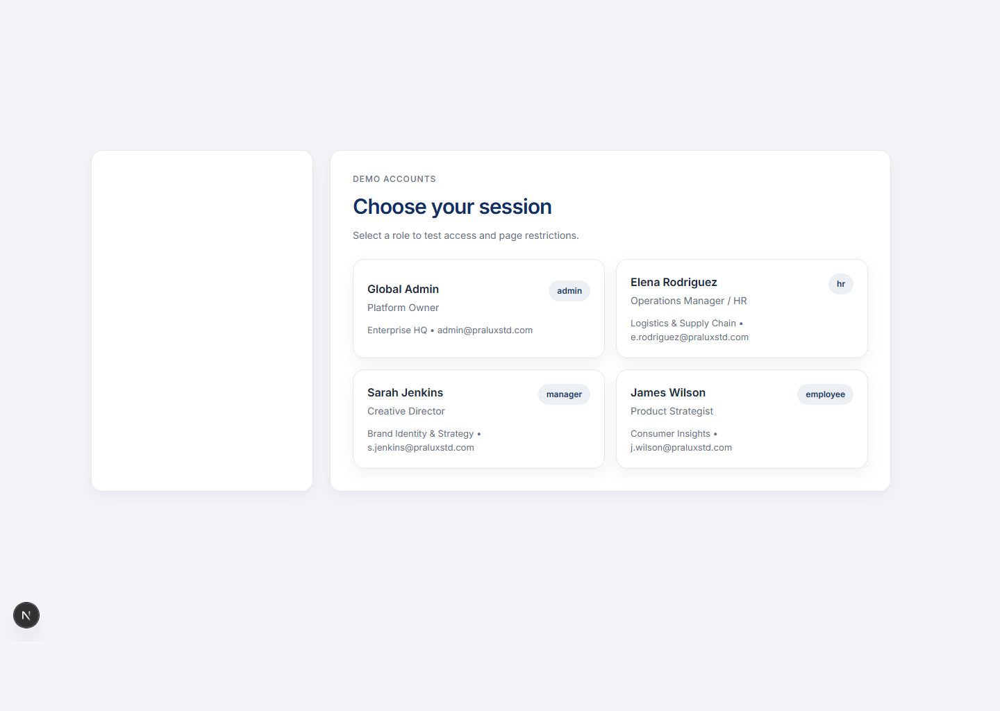
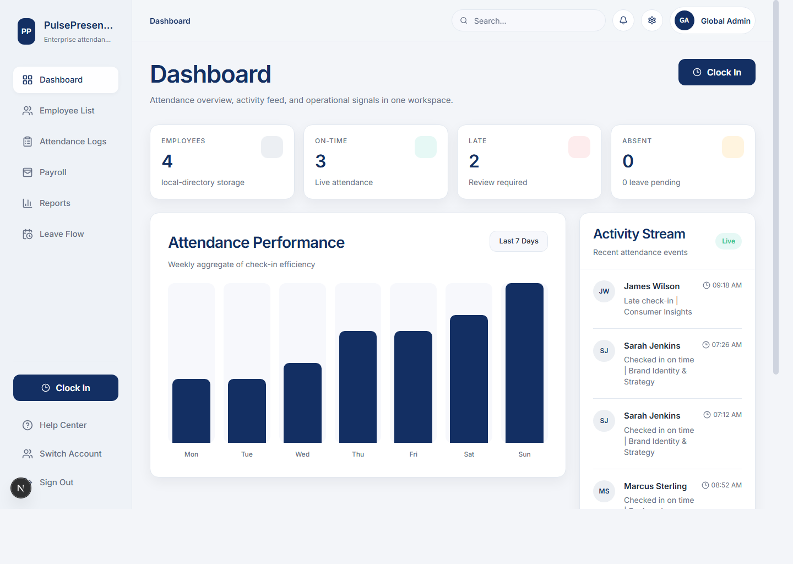
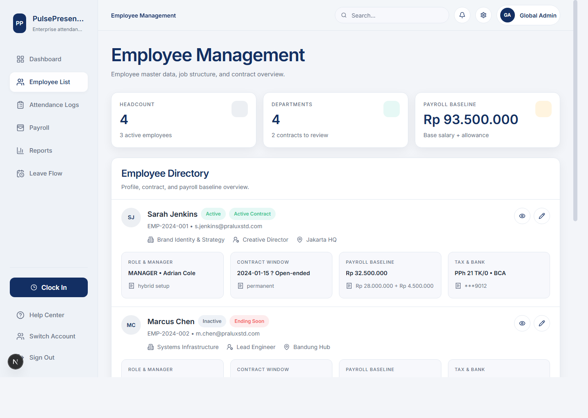
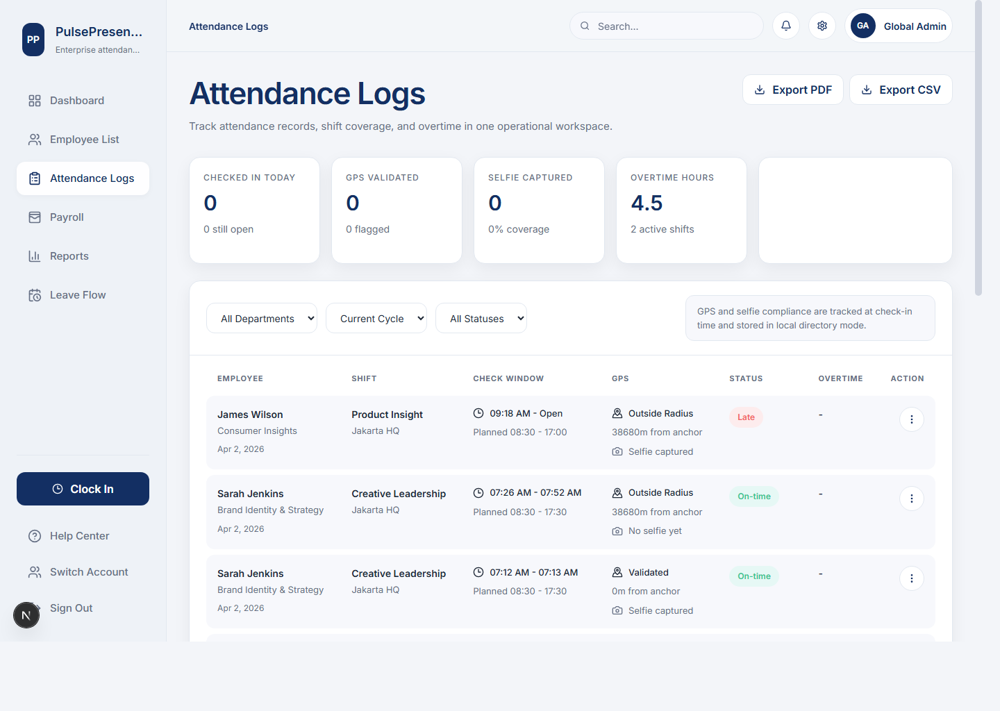
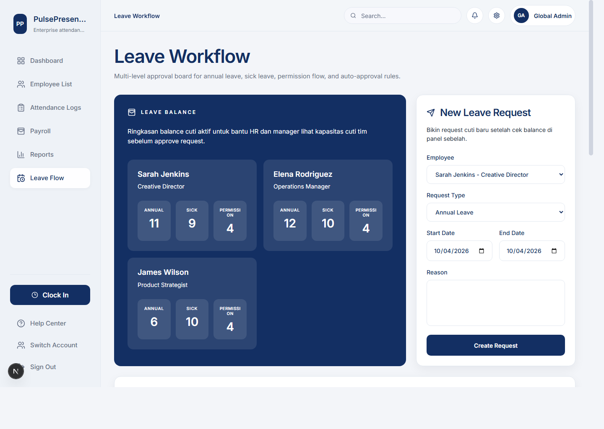
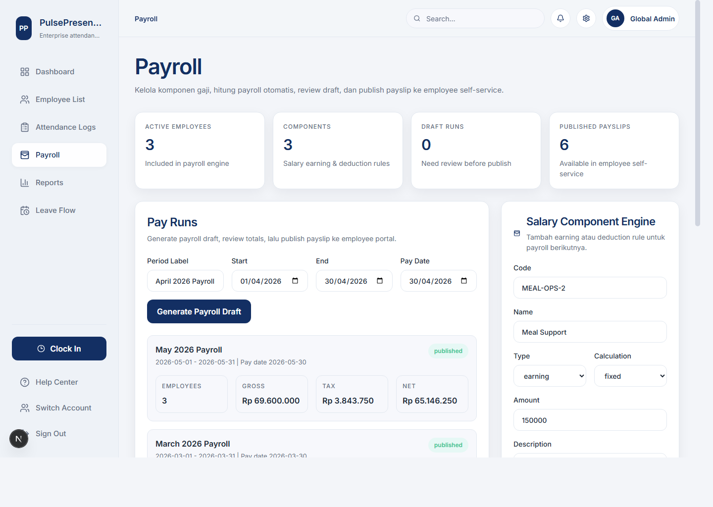
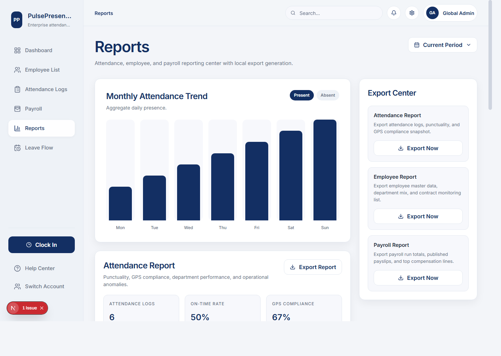
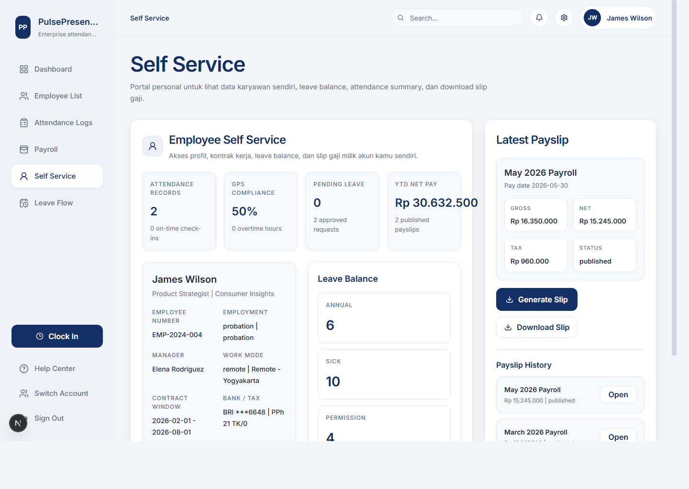

# HR App

White-label HRIS web app untuk attendance, leave, payroll, reporting, dan employee self-service.

## Stack
- Next.js 15
- React 19
- Tailwind CSS
- NestJS-style backend API
- Local directory storage untuk selfie, export, dan payslip

## Core Modules
- Employee Management
- Attendance & Time Management
- Leave & Approval
- Payroll
- Employee Self Service
- Reporting Center

## Demo Accounts
- Admin: `Global Admin`
- HR: `Elena Rodriguez`
- Manager: `Sarah Jenkins`
- Employee: `James Wilson`

## App Preview

### Login


### Dashboard


### Employee Management


### Attendance Logs


### Leave Flow


### Payroll


### Reports


### Employee Self Service


## Local Run

### Frontend
```bash
npm run dev
```

### Backend
```bash
cd backend
npm run dev
```

Frontend default: `http://127.0.0.1:3000`

Backend default: `http://127.0.0.1:4000`
