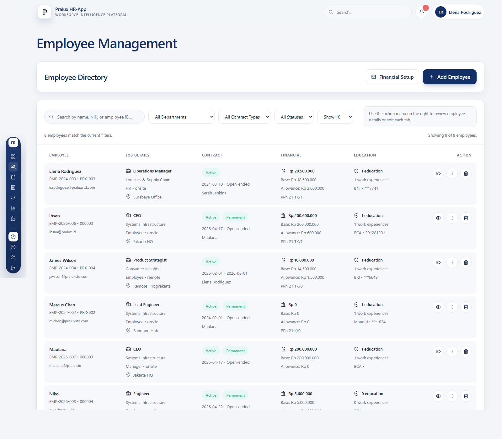
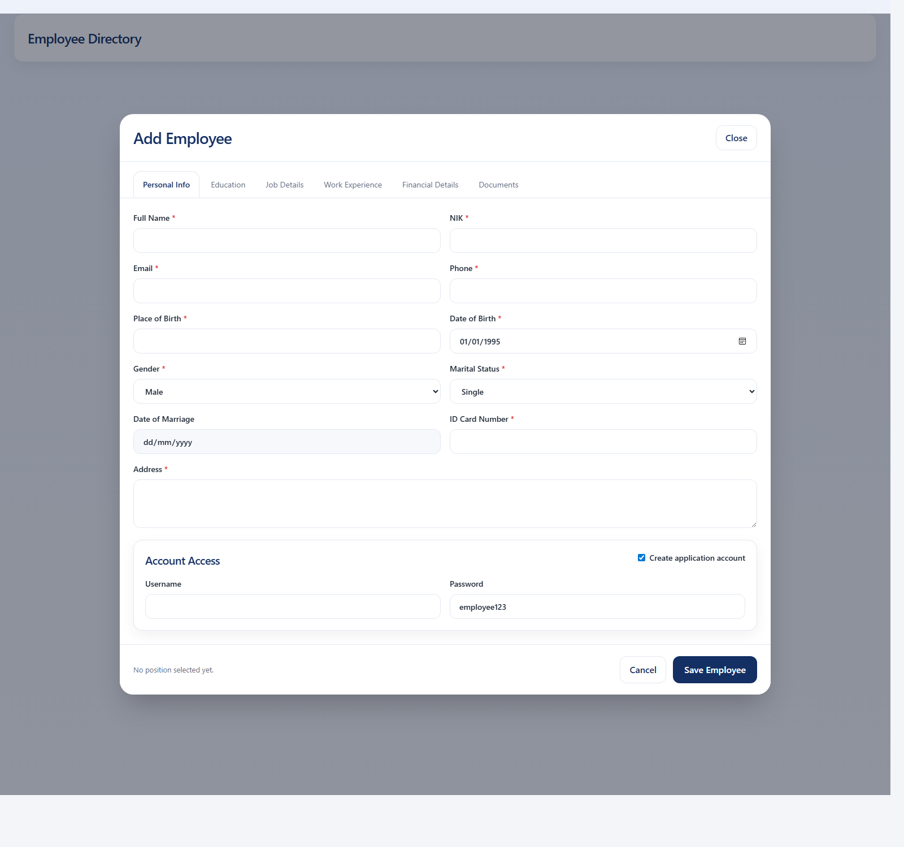
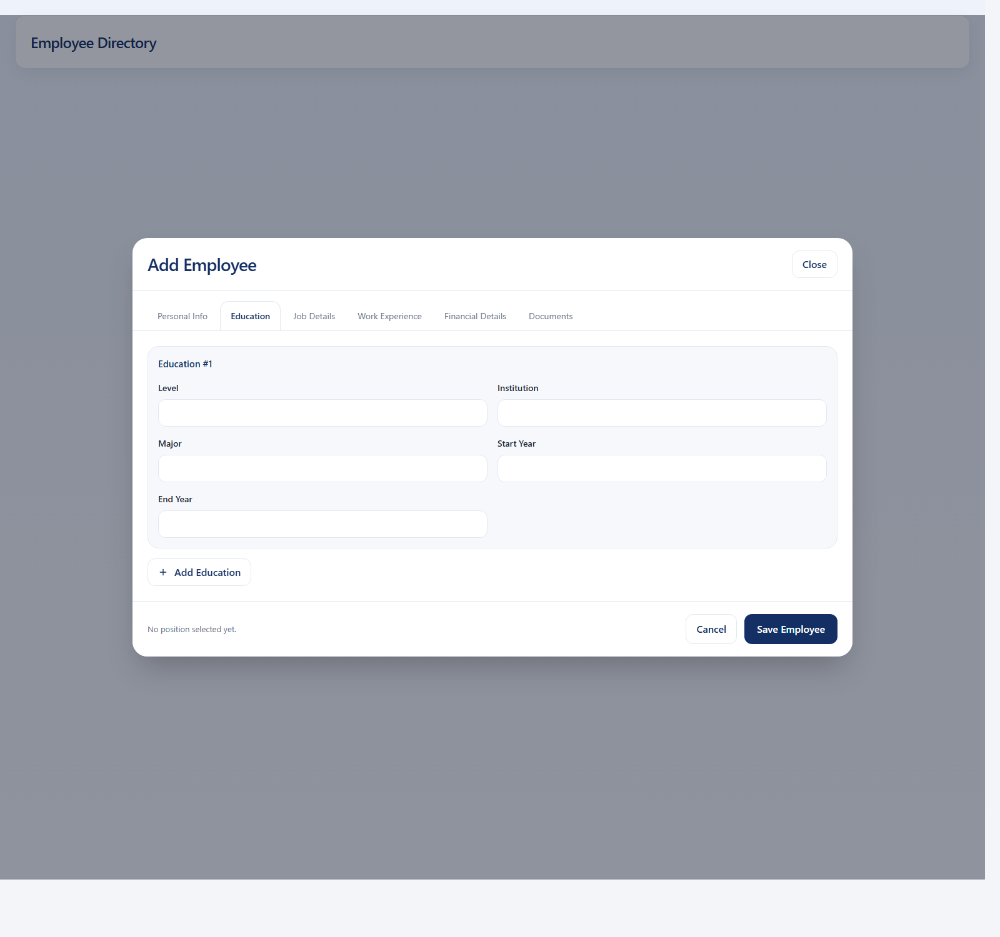
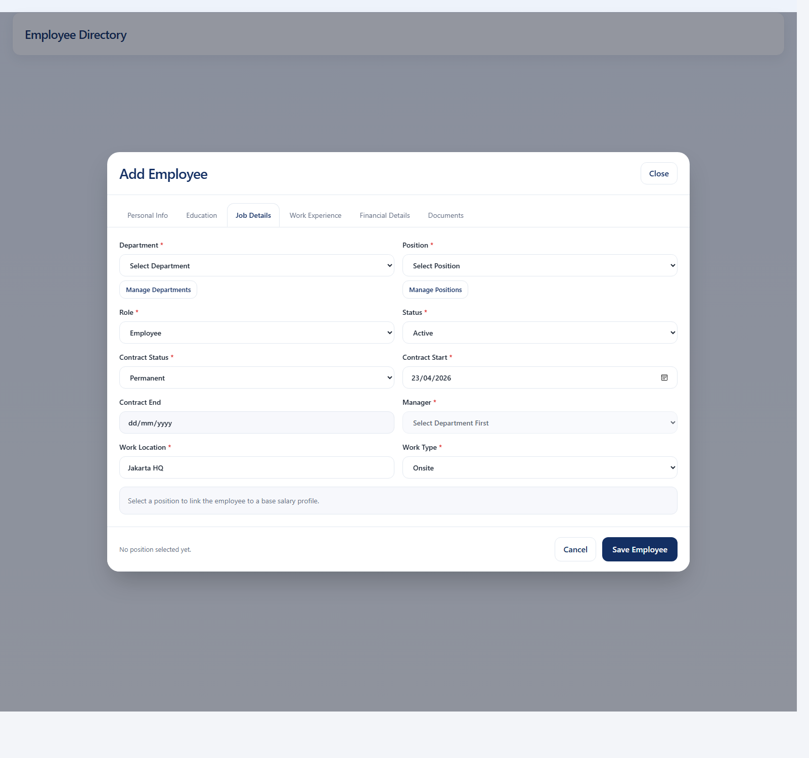
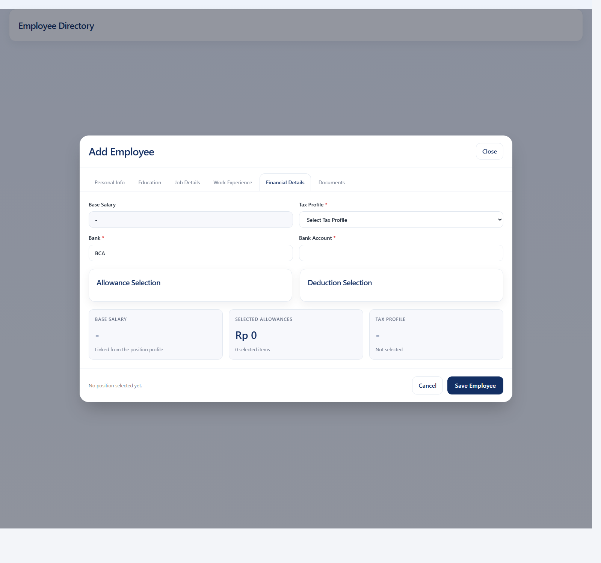
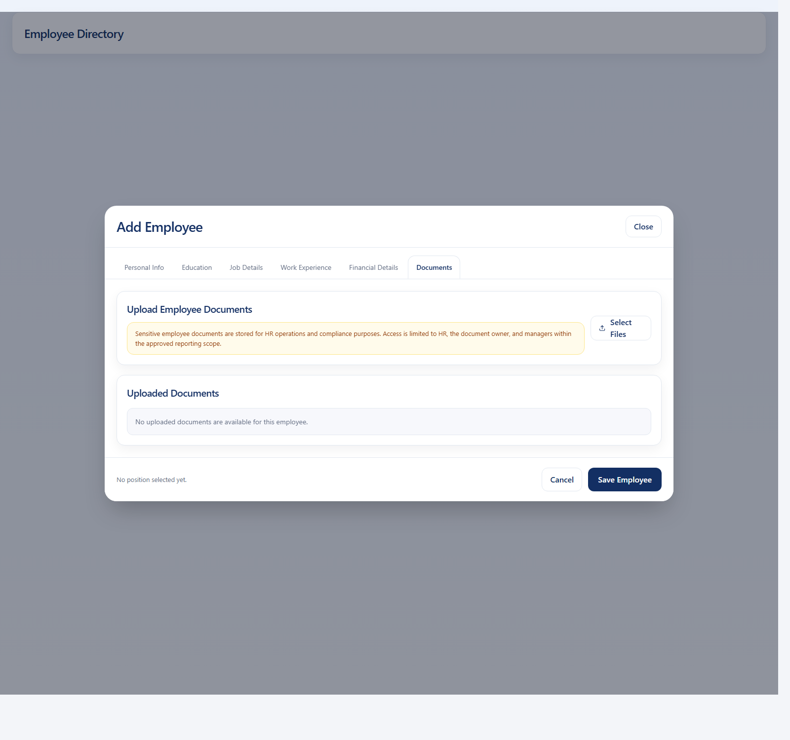

# Pralux HR-App User Guide

Updated: 2026-04-23

## 1. Introduction

Pralux HR-App is a workforce intelligence platform that combines HR operations, employee self-service, attendance, leave management, reimbursement, reports, and audit visibility in one workspace.

This guide is designed for:

- HR teams
- Administrators
- Managers
- Employees

The application supports both operational users and public demo flows through demo accounts on the login page.

## 2. Roles And Access

### Admin

- Access organization-wide dashboards
- Open employee management
- Review attendance and reports
- Access leave administration
- View activity logs

### HR

- Manage employee data and documents
- Manage attendance and leave operations
- Review reimbursement requests
- Access reports
- View activity logs

### Manager

- Access personal dashboard
- Submit attendance and request flows
- Review team approvals assigned to the manager

### Employee

- Access personal dashboard
- Clock in and clock out
- Submit leave, sick, half-day, overtime, and on-duty requests
- Submit reimbursement requests
- View profile information

## 3. Signing In

Use one of these login methods:

### Employee Login

1. Open the login page.
2. Enter the employee username.
3. Enter the password provided by HR.
4. Click `Sign In`.

### Demo Accounts

1. Open the login page.
2. Use one of the demo account cards on the right.
3. Click the preferred role card.
4. The app will create the session automatically.

## 4. Main Navigation

The sidebar contains the main modules:

- Dashboard
- Employee List
- Employee Attendance
- Reimbursement
- Activity Logs
- Profile
- Reports
- Leave System
- Help Center

The available items depend on the logged-in role.

## 5. Dashboard

The dashboard changes based on role.

### Employee And Manager Dashboard

- View personal attendance summary
- Track recent records
- Review leave and work activity
- Use the quick attendance button

### HR Dashboard

- View workforce totals
- Review latest employees
- Review headcount and leave insights
- Monitor attendance status and HR widgets

### Admin Dashboard

- Review organization-wide operational metrics
- Track attendance trends
- Monitor integrity and activity panels

## 6. Employee List

This module is intended for HR and Admin users.

### Key Actions

- Add employee
- Edit employee profile
- Manage compensation details
- Upload employee documents
- Configure login access
- Review leave allocation and financial attributes

### Add A New Employee

1. Open `Employee List`.
2. Click the add employee action.
3. Complete the employee form across all tabs.
4. Upload supporting documents if available.
5. Save the record.

### Employee Form Tabs

The employee form is split into these sections:

- Personal Info
- Education
- Job Details
- Work Experience
- Financial Details
- Documents

### Personal Info

Complete these fields carefully:

- NIK
- full name
- email
- birth place
- birth date
- gender
- marital status
- marriage date when applicable
- address
- identity card number
- phone number

### Education

Use the education tab to record:

- education summary
- structured education history
- level
- institution
- major
- start year
- end year

### Job Details

This tab controls the employee setup used by the rest of the app:

- department
- position
- role
- employment status
- work location
- work type
- manager name
- contract status
- contract start date
- contract end date

### Financial Details

This tab controls financial and access configuration:

- linked position salary
- earnings and deduction components
- tax profile
- bank name
- bank account
- app login enabled
- login username
- login password

### Documents

Documents can be uploaded per employee with:

- document type
- document title
- notes
- file upload

Supported operational use includes:

- identity documents
- diploma
- certificates
- tax documents
- family card
- employment contract
- BPJS
- other PDF or image files

### Manage Documents

1. Open the employee profile or edit form.
2. Upload supported files such as identity, certificates, contracts, or PDF documents.
3. Save the employee.
4. Use preview or download actions to review stored documents.

### Reset Employee Password

HR can reset employee login credentials when required:

1. Open the employee record.
2. Use the password reset action.
3. Enter the new password.
4. Confirm the reset.

### Department And Position Masters

The employee module also supports master data management:

- manage departments
- manage positions
- update active or inactive state
- define base salary for positions

## 7. Employee Attendance

The attendance hub is the main workspace for attendance-related actions.

### Clock In

1. Use the `Clock In` quick action from the sidebar or page.
2. Confirm the attendance modal.
3. Allow location or camera access if required.
4. Submit check-in.

### Clock Out

1. Use the same attendance quick action.
2. Review the active attendance session.
3. Submit check-out.

### Attendance History

- Review attendance records
- Check current status
- Track on-time, late, or open sessions

### Attendance Hub

The main attendance hub lets users open a dedicated page for each workflow:

- On Duty Request
- Sick Submission
- Leave Request
- Half Day Leave
- Submit Overtime
- Leave Balance
- Attendance Report for HR
- Leave Report for HR

Each page has its own form, history view, and summary cards.

### On Duty Request

Use this flow when the employee is working outside the normal office routine, such as field work or business assignment.

Steps:

1. Open `Employee Attendance`.
2. Choose `On Duty Request`.
3. Fill the date.
4. Enter the description or assignment details.
5. Submit the request.
6. Review the generated request history.
7. Review the attendance records generated from approved on-duty requests.

### Sick Submission

Use this flow when an employee needs to report sick leave.

Steps:

1. Open `Sick Submission`.
2. Set start date and end date.
3. Enter the reason.
4. Upload the doctor letter or medical document if required.
5. Submit the request.
6. Track request status from the same page.

### Leave Request

Use this flow for standard leave allocation usage.

Steps:

1. Open `Leave Request`.
2. Choose the leave type allocated to the employee.
3. Set start and end date.
4. Add the reason.
5. Upload a supporting document when needed.
6. Submit.
7. Review the leave records table and status.

### Half Day Leave

Use this flow for short leave in half-day increments.

Steps:

1. Open `Half Day Leave`.
2. Choose the date.
3. Select `Morning` or `Afternoon`.
4. Enter the reason.
5. Submit the request.
6. Review the request history and balance impact.

### Submit Overtime

Use this flow for overtime records that need approval.

Steps:

1. Open `Submit Overtime`.
2. Set the overtime date.
3. Enter the overtime duration in minutes.
4. Add the overtime reason.
5. Submit the request.
6. Review the overtime records and approval status.

### Leave Balance

This page helps employees and HR review leave allocations.

Use it to check:

- available days
- carry-over days
- balance year
- sick leave usage
- leave type allocations

### Attendance Report

This page is available for HR users.

Use it to:

- monitor attendance coverage
- review attendance history
- inspect team-level attendance records
- compare attendance status across employees

### Leave Report

This page is available for HR users.

Use it to:

- review leave history across the organization
- inspect leave type and status
- open supporting documents for sick submissions or other leave requests

### Approval Queue

Managers can use the approval area inside attendance flows to:

- review pending leave requests
- review pending overtime requests
- approve or reject from the same page
- open supporting documents before making a decision

### Employee Request Pages

Employees and managers can access:

- Leave Request
- Sick Submission
- Half Day Request
- On Duty Request
- Submit Overtime
- Leave Balance

### HR Attendance View

HR can access:

- Attendance report
- Leave report
- Team-level overview
- Review queues

## 8. Leave System

This module is mainly for Admin and HR operations.

### What You Can Do

- Review leave balances
- Configure leave-related administration
- Review leave flow visibility

### Employee Leave Flows

Leave requests can be created from the attendance workspace. Each request records:

- employee
- leave type
- date range
- reason
- approval status
- supporting document when applicable

## 9. Reimbursement

The reimbursement module supports employee submission and approval flows.

### Employee Flow

1. Open `Reimbursement`.
2. Create a new request.
3. Select the claim type.
4. Enter the amount and receipt date.
5. Upload a receipt or supporting file.
6. Submit the request.

### HR And Admin Flow

- Review submitted reimbursement requests
- Track status transitions
- Review claim type allocations
- Process approvals

### Manager Flow

- Review approvals assigned to the manager when required

## 10. Reports

The reports area is intended for Admin and HR users.

### Available Reporting Areas

- Attendance reports
- Employee list reports
- Reimbursement reports
- Other operational report views available in the app

### Typical Steps

1. Open `Reports`.
2. Apply filters or period selection.
3. Review the preview panel.
4. Export the report when needed.

## 11. Activity Logs

The activity logs module is available to HR and Admin users.

### Purpose

- Track operational changes
- Review who changed what
- Filter by module, role, date, or target
- Support audit and troubleshooting use cases

### Typical Use

1. Open `Activity Logs`.
2. Apply filters.
3. Review event summaries, actors, and targets.
4. Use the table to inspect operational activity.

## 12. Profile

The profile page is mainly used by employees and managers.

### Available Information

- personal profile
- department and position
- work-related details
- compensation visibility where allowed

## 13. Notifications

Managers and HR users can receive reminder notifications for pending approvals. The notification bell in the top bar helps users identify:

- pending leave approvals
- overtime approvals
- reimbursement approvals

## 14. Help Center

The `Help Center` button in the sidebar opens the built-in help page. From there users can:

- open the online user guide
- download the PDF guide
- review quick explanations of each module
- access screenshot references

## 15. Recommended User Walkthroughs

### Employee

1. Sign in
2. Open Dashboard
3. Clock in
4. Submit leave or overtime if needed
5. Review reimbursement page
6. Open profile

### Manager

1. Sign in
2. Review dashboard
3. Review attendance workspace
4. Check pending approvals from notifications
5. Review personal profile

### HR

1. Sign in
2. Review dashboard
3. Open employee list
4. Manage employee records and documents
5. Review attendance and leave reports
6. Review reimbursement and reports
7. Open activity logs

### Admin

1. Sign in
2. Review organization-wide dashboard
3. Open employee and attendance modules
4. Review reports
5. Review leave administration
6. Audit operational logs

## 16. Troubleshooting

### Login Does Not Work

- Confirm username and password
- Confirm the account is enabled by HR
- Use a demo account if you are testing the app

### Clock In Button Is Not Available

- Confirm you are signed in as a role with employee attendance access
- Confirm the page has loaded employee attendance data
- Refresh the page and try again

### File Upload Or Preview Fails

- Confirm the uploaded file type is supported
- Confirm the storage path is available
- Ask HR or Admin to verify the document record

### Data Does Not Refresh

- Refresh the page
- Confirm the backend service is reachable
- Confirm the database service is active

## 17. Screenshot Index

The guide includes these core screenshots:

- Login
- HR Dashboard
- Employee Dashboard
- Employees
- Attendance Hub
- On Duty Request
- Sick Submission
- Leave Request
- Half Day Leave
- Submit Overtime
- Leave Balance
- Attendance Report
- Leave Report
- Leave
- Reports
- Self-Service
- Profile
- Reimbursement
- Activity Logs
- Help Center

## 18. Conclusion

Pralux HR-App is designed to centralize workforce operations in a role-aware experience. For daily usage, users should rely on the main sidebar, approval notifications, and Help Center for quick guidance.
